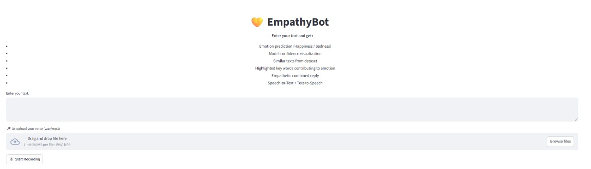

# 💛 EmpathyBot: Sentiment-Aware Chat System with Advanced RAG and Few-Shot Prompt Engineering - Project Documentation


[💻 Demo on Google Drive](https://drive.google.com/drive/folders/1-sMI0HkxM1E31fvujCetamvZm8MA_Sc1?hl=ar)


**EmpathyBot** is a Streamlit-based web application that allows users to input text and receive a detailed emotional analysis (happiness or sadness) along with an empathetic response derived from a curated dataset. The app leverages transformer-based NLP models, embeddings, and FAISS for semantic similarity retrieval.

---


## 🖼️ Screenshots

### Interface  


### Example Output  


---
## 🌟 Features

- **Emotion Prediction**  
  Detects whether input text expresses happiness or sadness using `nlptown/bert-base-multilingual-uncased-sentiment`.

- **Model Confidence Visualization**  
  Displays confidence scores for each star rating as a bar chart for transparency.

- **Similar Text Retrieval**  
  Uses **SentenceTransformer embeddings** and **FAISS** to fetch up to 3 similar examples from the dataset that match the predicted emotion.

- **Empathetic Combined Reply**  
  Synthesizes a response based on retrieved texts to provide an empathetic message.

- **Professional UI/UX**  
  Everything is centered using CSS, with clear bullets and highlighted text for better readability.


---

## 🗂 Dataset

- Dataset: [`cardiffnlp/tweet_eval` (Emotion subset)](https://huggingface.co/datasets/cardiffnlp/tweet_eval)  
- Focused on two main labels for simplicity:  
  - **1 → Positive / Happy / Cute**  
  - **3 → Negative / Sad / Worried / Angry**  

| Label | Meaning (example)                |
| ----- | -------------------------------- |
| 0     | Neutral / No strong emotion      |
| 1     | Positive / Happy / Cute          |
| 2     | Caring / Empathetic / Supportive |
| 3     | Negative / Sad / Worried / Angry |

- Preprocessing: lowercase, remove URLs and mentions, clean whitespace.

---

## 🛠 Architecture & Workflow

### 1. User Input
- Users enter or paste text in a **centered text area**.

### 2. Emotion Prediction
- Uses **BERT-based model**:
  - 1–2 stars → sadness
  - 3–5 stars → happiness
- Returns predicted emotion and confidence scores.

### 3. Keyword Highlighting
- Detects key emotion words in input.
- Highlights words with color-coded backgrounds:
  - Green → Happiness  
  - Red → Sadness

### 4. Similar Text Retrieval
- Text is converted to embeddings using `SentenceTransformer`.
- FAISS is used to efficiently retrieve the top `k` texts from the dataset that match the predicted emotion.

### 5. Empathetic Reply
- Retrieved texts are combined into one **empathetic response**.
- Displayed as a bullet point with highlighted content.

### 6. Output Display
- Highlighted input text
- Predicted emotion
- Similar texts from dataset
- Empathetic reply
- Model confidence visualization

---

## ⚙ Installation & Setup

### 1. Clone the Repository
```bash
git clone https://github.com/ahmdeltoky03/EmpathyBot.git
cd EmpathyBot
  ```
### 2. Install Dependencies
```bash
pip install -r requirements.txt
```
### 3. Once running, open the provided local URL in your browser or use ngrok to expose it publicly.
```bash

This is fully compatible with VSCode, Jupyter, or Colab Markdown cells.  

Do you want me to **combine this with the author and usage sections** into one full notebook-ready Markdown cell?

```

## 🔍 Model & Algorithm Details

- **Sentiment Model:** `nlptown/bert-base-multilingual-uncased-sentiment`  
  - Maps **1–2 stars → sadness**, **3–5 stars → happiness**  
  - Provides **all-score outputs** for visualization  

- **Embedding Model:** `all-MiniLM-L6-v2` (SentenceTransformer)  
  - Produces embeddings for **semantic similarity search**  
  - Uses **FAISS Index** for fast nearest-neighbor retrieval  

- **Empathetic Response:**  
  - Combines **top k similar texts**  
  - Adds disclaimer: `"I’m not a therapist; please seek professional help for serious issues."`  

---

## 🎨 UI/UX Design

- **Centered layout:** input box, buttons, output all aligned  
- **Highlighted words:** emotion-specific colors  
- **Bullet points:** summarize predictions, similar texts, and empathetic reply  
- **Confidence chart:** interactive bar chart  

---

## 🧪 Usage & Evaluation

### User Workflow
1. **Type or paste your text** in the input box.  
2. **Click Analyze**.  
3. **View outputs**:  
   - Predicted emotion  
   - Highlighted input  
   - Similar texts from dataset  
   - Empathetic reply  
   - Model confidence scores  

### 📈 Evaluation
- Generate **confusion matrix** and **classification report** on the dataset.  
- Helps validate the **accuracy of emotion predictions**.  
- Binary mapping (**happy/sad**) simplifies analysis and improves clarity.

---

## 🎙️ New Audio Features  

EmpathyBot now supports **speech-based interaction** in addition to text:  

### 🎵 Upload Audio  
- Upload a **`.wav` or `.mp3`** file.  
- The system will **transcribe speech → predict emotion → generate reply**.  

### 🎤 Microphone Recording  
- Record directly in the app.  
- Recording **auto-stops after 10 seconds**.  
- Supports the same workflow:  
  - **STT (Speech-to-Text)** using Wav2Vec2  
  - **Emotion Prediction** (Happy 😃 / Sad 😢)  
  - **Empathetic Reply** synthesized from dataset  
  - **TTS (Text-to-Speech)** playback of the reply  


### 🔊 Example Flow  
1. Record or upload your audio.  
2. EmpathyBot transcribes your voice.  
3. Predicts **happiness** or **sadness**.  
4. Generates an **empathetic response**.  
5. Speaks it back to you with **TTS**.  

--- 

### 👤 Author
**Ahmed Eltokhy**  
GitHub: ahmdeltoky03  
Email: ahmdeltoky4@gmail.com
